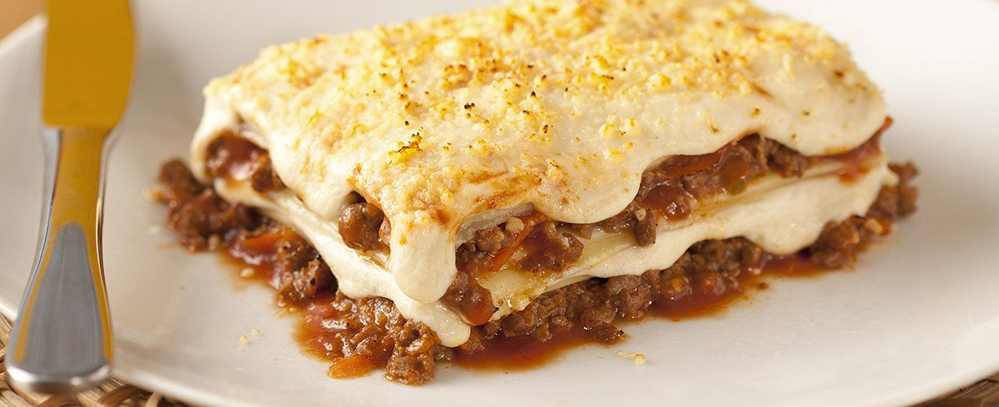

# Lasanha à Bolonhesa

Lasanha com molho bolonhesa com MAGGI Caldo de Carne e molho branco com Creme de Leite NESTLÉ

RENDIMENTO:12 PORÇÕES
PREPARO: 01:30
DIFICULDADE: FÁCIL

## Ingredientes

### Lasanha:
- meio quilo de massa para lasanha

### Molho Bolonhesa:
- 2 colheres (sopa) de óleo
- meio quilo de carne moída
- 1 cebola pequena picada
- 1 cenoura pequena ralada no ralo fino
- meia xícara (chá) de salsão picado
- 1 lata de polpa de tomate
- 2 tabletes de MAGGI Caldo Carne

### Molho Branco:
- 2 colheres (sopa) de manteiga
- 2 e meia colheres (sopa) de farinha de trigo
- meio litro de Leite Líquido NINHO Forti+ Integral
- 1 pitada de noz-moscada
- 1 colher (chá) de sal
- 1 pitada de pimenta-do-reino
- 1 caixinha de NESTLÉ Creme de Leite

### Montagem:
- 250 g de queijo mozarela fatiado
- 2 colheres (sopa) de queijo parmesão ralado

## MODO DE PREPARO

### Lasanha:
1. Cozinhe a massa de acordo com as instruções da embalagem e coloque em um recipiente com água fria até o momento de montar.

### Molho Bolonhesa:
1. Em uma panela, aqueça o óleo e refogue a carne.
1. Junte a cebola, a cenoura, o salsão e deixe refogar até murchar.
1. Acrescente a polpa de tomate e o tablete de MAGGI Caldo, dissolvido em 1 xícara (chá) de água quente. Deixe cozinhar por cerca de 10 minutos, ou até apurar o molho. Reserve.

### Molho Branco:
1. Em uma panela, derreta a manteiga, junte a farinha de trigo e deixe dourar. Aos poucos junte o Leite NINHO, mexendo sempre para não formar grumos.
1. Acrescente a noz moscada, o sal, e a pimenta-do-reino.
1. Quando adquirir consistência cremosa, retire do fogo, acrescente o NESTLÉ Creme de Leite, misture bem e reserve.
Montagem:
1. Em um recipiente refratário (20 x 30 cm), coloque uma porção de molho bolonhesa; cubra com uma camada de massa, e uma porção de molho branco e coloque o queijo mozarela. Repita as camadas até a borda do recipiente.
1. Finalize com o queijo parmesão ralado e leve ao forno alto (220°C), preaquecido, por cerca de 20 minutos ou até dourar. Sirva.

## Créditos

[receitasnestle.com.br](https://www.receitasnestle.com.br/receitas/lasanha-a-bolonhesa-saborosa)
