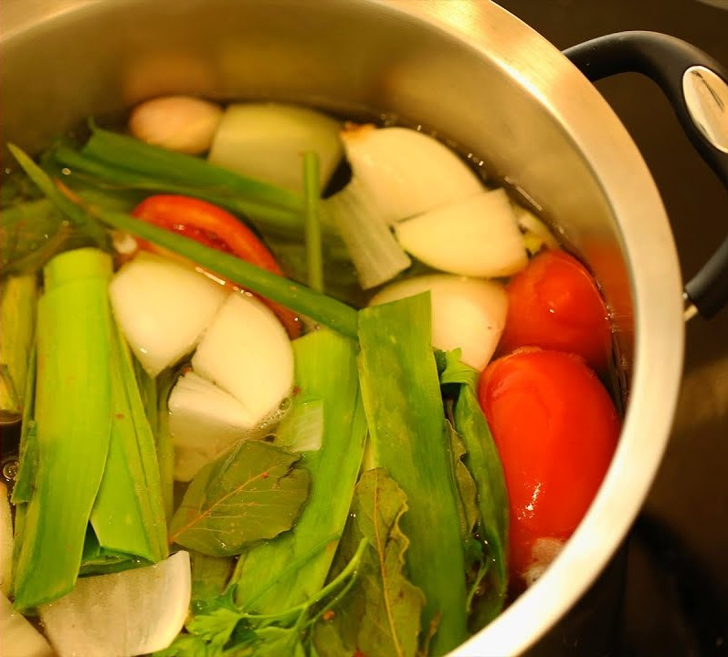

# Caldo de Legumes

Descrição curta.

## Ingredientes

- Água
- Cenoura
- Tomate
- Alho poró
- Cebola
- Folha de louro
- Alho
- Salsinha e cebolinha

## Preparo
1. Cortar os ingredientes em pedaços grandes e colocar na água fervente
1. Adicionar sal e pimenta do reino
1. Cozinhar por 20 a 30 minutos, filtrar e armazenar o caldo no congelador em pequenas porções

Dica: os sólidos podem ser batidos no liquidificador para fazer uma sopa.

**Créditos**: [Luiza Zaidan](https://www.youtube.com/watch?v=k4MMTIBCiSI)
