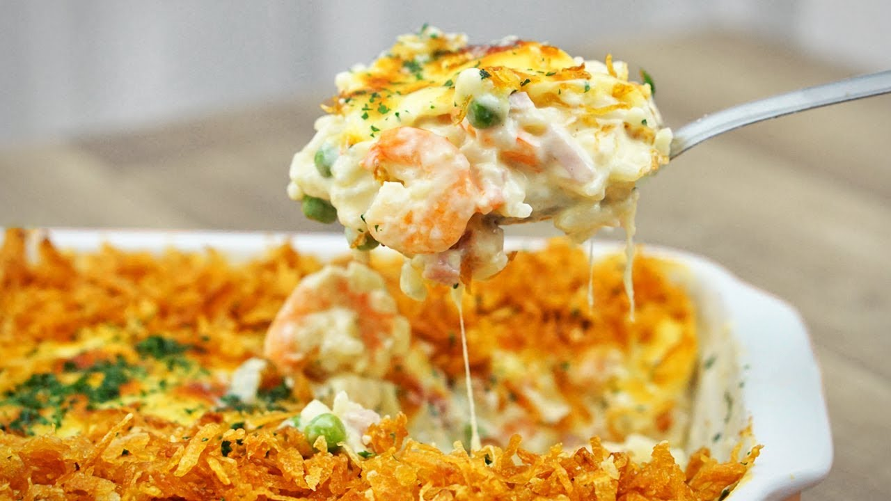

# Camarão Internacional

Receita caseira para o Camarão Internacional do Coco Bambu!

## Ingredientes

- 1 colher de sopa de manteiga
- ½ cebola picada
- 2 dentes de alho
- 500g de camarão descascado e limpo
- sal a gosto
- 1 pote de requeijão cremoso
- 1 caixa de creme de leite
- 200g + 100g de muçarela ralada
- 200g de presunto
- 100g de ervilha congelada
- 250g de arroz cozido
- batata palha a gosto
- salsinha a gosto

## Preparo

### Batata palha
1. Ralar a batata em tirinhas
1. Fritar em óleo quente

### Recheio
1. Em uma panela com manteiga, refogue a cebola e o alho
1. Em seguida, adicione o camarão limpo e tempere com sal (se cozinhar por muito tempo, o camarão pode ficar borrachudo!)
1. Adicione o requeijão cremoso, creme de leite e queijo mussarela ralado. Misture até o queijo derreter
1. Adicione o presunto em cubos, a ervilha e o arroz já cozido

### Forno
1. Misture tudo, coloque em um refratário, cubra com queijo mussarela ralado e leve ao forno por 15 minutos (ou até gratinar)
1. Quando sair do forno, cubra com batata palha e salsinha picada. Sirva bem quente!

**Créditos**: [Cansei de Miojo](http://www.canseidemiojo.com.br/camarao-internacional/)
