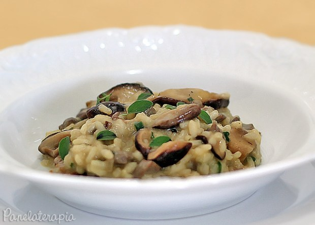

# Risoto Filé Mignon Shitake

O Shitake ou “Shiitake” é um cogumelinho danado de saudável! É rico em proteínas, possui aminoácidos essenciais, controla a pressão arterial, diminui o colesterol, fortalece as defesas do organismos, inibe tumores, e mais um monte de coisas boas!

## Preparando o Shitake

Ele só deve entrar no final da receita porque se cozinhar demais fica borrachudo.

Refogue 1 dente de alho picado ou espremido em 1 colher (sopa) de manteiga. Faça isso em fogo bem baixo para o alho não dourar. Junte 100g de Shitake, 1 colher (sopa) de shoyu, sal e pimenta do reino de acordo com seu gosto. Quando o cogumelo murchar, desligue o fogo e reserve.

## Agora vamos para o Risoto

### Ingredientes

- 1,5 litros de caldo de legumes ou de carne que pode ser caseiro ou industrializado, neste caso, dilua 1 tablete ou 1 envelope em 1,5 litros de água;
- 1 colher (sopa) de manteiga;
- 1/2 cebola picada;
- 150g de filé mignon em cubinhos temperado com antecedência de pelo menos 1 hora;
- 1 xícara de arroz próprio para risoto (arbóreo ou carnaroli);
- 2 colheres (sopa) de cheiro verde;
- Sal e pimenta à gosto.

1. Mantenha o caldo fervendo ao lado da panela que vai fazer o risoto.

1. Refogue a cebola na manteiga sem deixar dourar, apenas para murchar, junte a carne e mexa até dourar. Junte o arroz e misture bem. Adicione uma concha do caldo e mexa sem parar (em fogo baixo) até quase secar. Repita esta operação, concha por concha, até o arroz ficar bem macio.  A quantidade de caldo usado pode variar dependendo da panela usada e do fogão. Eu usei mais ou menos 1,2 litros.

1. Misture o shitake, adicione cheiro verde. Corrija o sal e polvilhe pimenta do reino.

**Opcional:** parmesão ralado e folhinhas de tomilho.

**Créditos**: [Panela terapia](https://panelaterapia.com/2013/08/risoto-de-file-mignon-e-shitake.html)
